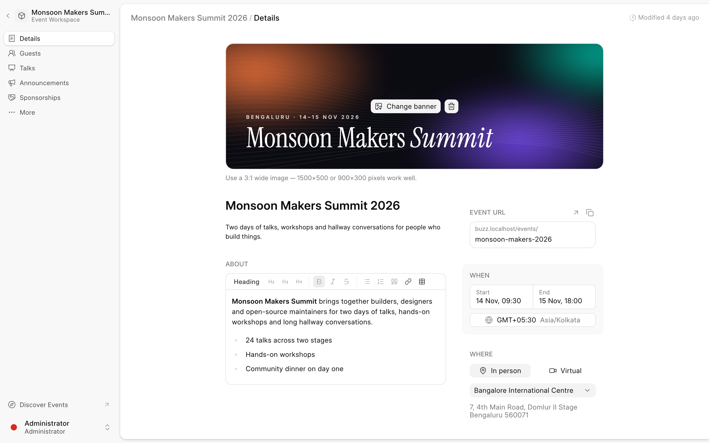
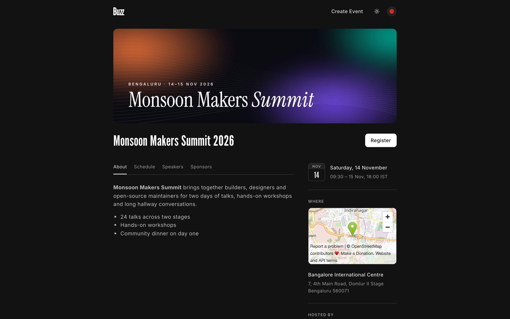
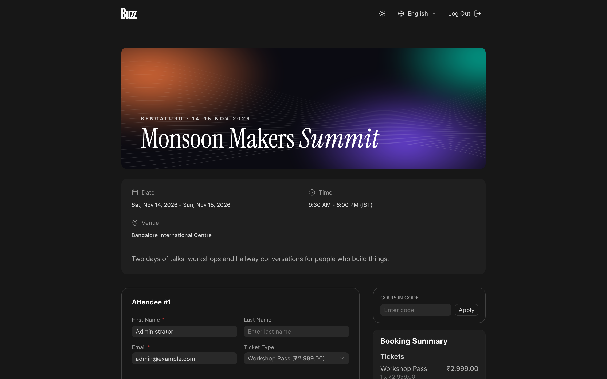
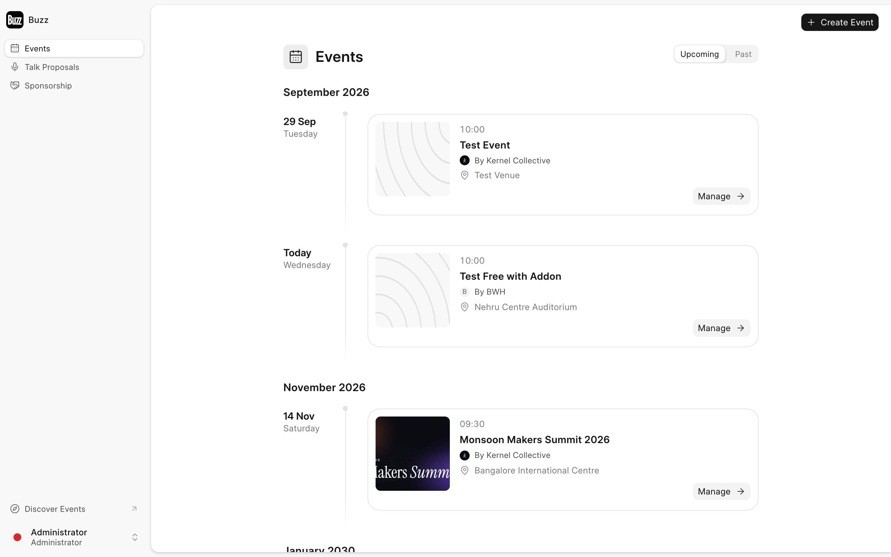
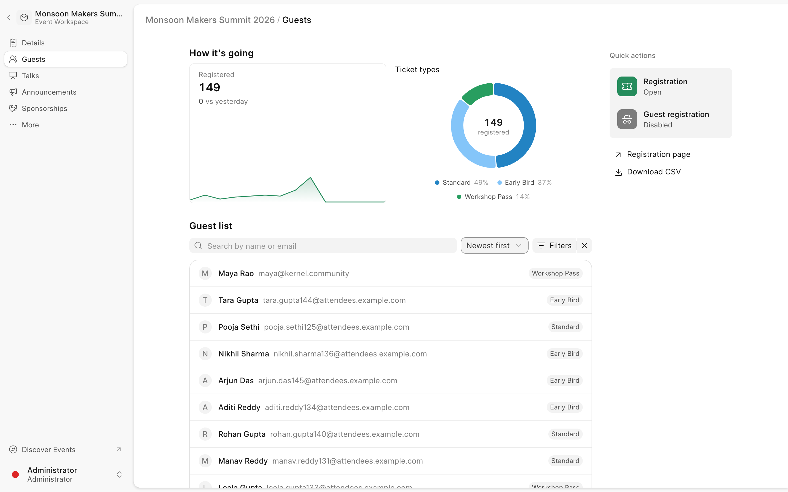
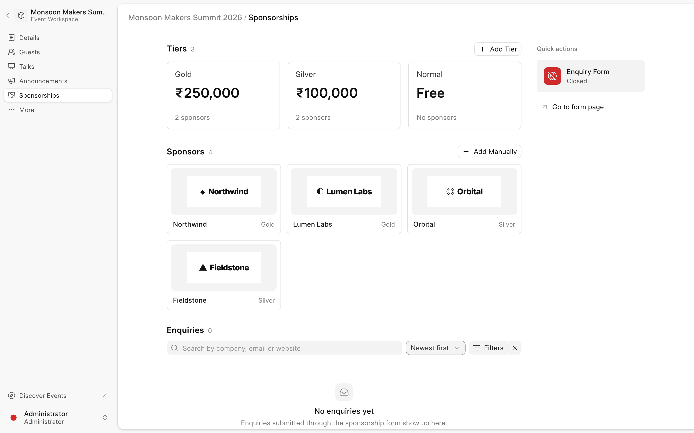

<div align="center" markdown="1">

<a href="https://github.com/BuildWithHussain/buzz">
  
</a>

<h1>Buzz</h1>

<a href="https://bwh.tech"></a>

**Open source, self-hosted event management platform.**<br>
Tickets, add-ons, sponsorships, check-ins, and attendee self-service — all driven by a single **Buzz Event**.

[](https://github.com/BuildWithHussain/buzz/actions/workflows/ci.yml)
[](https://github.com/BuildWithHussain/buzz/actions/workflows/ui-tests.yml)
[](https://www.gnu.org/licenses/agpl-3.0)
[](https://github.com/BuildWithHussain/buzz/commits/main)
[](https://github.com/BuildWithHussain/buzz/stargazers)

<a href="#installation">Installation</a> · <a href="./ARCHITECTURE.md">Architecture</a> · <a href="https://t.me/bwh_buzz">Telegram Group</a>

</div>



### Stack

1. **Frappe Framework**: backend, data model, and the Desk admin interface.
2. **Frappe UI** (Vue 3 + TailwindCSS): the dashboard at `/b` for organisers, attendees, speakers, and sponsors.
3. **Server-rendered pages**: public event pages at `/events/<route>` and a discover page at `/events`.

Everything hangs off a **Buzz Event**: ticket types, add-ons, schedule, talks, sponsorship tiers, and custom fields. Events belong to a **team**, so several organisations can run events on one site.

### Features

#### Public event pages

Every published event gets a themed page with its schedule, speakers, sponsors, venue map, and share images. `/events` lists popular events and categories.



#### Registration and payments

The booking form builds itself from the event's ticket types, add-ons, and custom fields. It supports coupons, GST, multiple attendees per booking, offline payments, and online payments through Frappe's [Payments](https://github.com/frappe/payments) app. Refunds sync back from the gateway.



#### Manage events from the dashboard

Organisers create and run events without touching Desk. Teams see their upcoming and past events, and each event opens into a workspace.



The workspace covers:

- **Details**: banner, description, dates, timezone, venue or virtual (Zoom) setup, co-hosts.
- **Guests**: registration trends, ticket type split, searchable guest list, CSV export.
- **Talks**: review talk proposals and open or close submissions.
- **Announcements**: email an event's guests or speakers.
- **Sponsorships**: tiers, sponsors, and enquiries from the sponsor enquiry form.





#### Attendee self-service

Attendees see their bookings, tickets (with QR codes), talk proposals, and sponsorships under `/b/account`. Within deadlines set in **Buzz Settings**, they can change add-ons, transfer tickets, or request a cancellation.

#### Check-in

Volunteers scan ticket QR codes at `/b/check-in` to check guests in.

### Installation

Install with the [bench](https://github.com/frappe/bench) CLI. Buzz needs Frappe v16 or v17 and the Payments app.

```bash
cd $PATH_TO_YOUR_BENCH
bench get-app payments
bench get-app BuildWithHussain/buzz --branch main
bench --site <your-site> install-app buzz
```

Use `--branch develop` to try the 2.x beta.

### Contributing

This app uses `pre-commit` for code formatting and linting. Please [install pre-commit](https://pre-commit.com/#installation) and enable it for this repository:

```bash
cd apps/buzz
pre-commit install
```

It runs ruff for Python, and oxlint and oxfmt for the dashboard.

#### Branches

Buzz is developed on two release lines:

| Branch | Line | What it is |
| --- | --- | --- |
| `main` | 1.x — stable | The supported release line, and what `bench get-app` installs by default. |
| `develop` | 2.x — beta | Where the next major lands, including team-based multi-tenancy. Not yet released. |

Open your pull request against `develop`. Once it is merged, add a `backport main`
label to cherry-pick it onto the stable line — the [backport
workflow](.github/workflows/backport.yml) opens the follow-up PR for you. Changes
that target 2.x only, such as anything building on teams, stay on `develop` and
should not be labelled.

### Tests

- Python: `bench --site <site> run-tests --app buzz`
- End-to-end: Playwright specs live in `e2e/` (`yarn test:e2e`).

GitHub Actions runs unit tests, UI tests, linters (Semgrep, pip-audit), and a dashboard type check on every pull request.

### License

[AGPL-3.0](license.txt)
